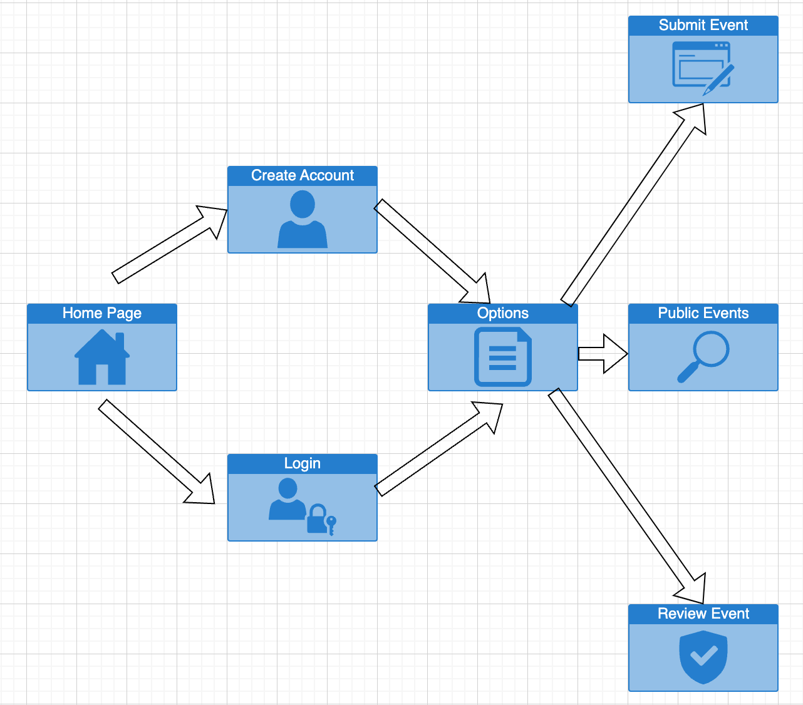

# EVENT-A-GRAM

A webapp which allows users to create and search for a range of local events.

DEPLOYED APPLICATION

HOW TO INSTALL AND RUN THE APPLICATION
The webapp is deployed on Heroku, so no special instructions are required, simply click on the link. 

TEAM MEMBERS
Gina Zivkovic (Team Leader): https://github.com/GEEZEE91
Ash Shilkin: https://github.com/web3zero

WHAT WE BUILT
We created a webapp that allows users to login, create events under a number of categories, and edit the events if needed.

WHY
Centralised location for events hosted by individuals or small groups; as opposed to large scale events. 

EVENT DETAILS
Can be public or private. All ages or over 18. 

SEARCH CAPABILITIES
Users can search for events based on category, age group and private Vs public. 

TECHNOLOGIES USED
Heroku
SQL
Node.js
JavaScript
CSS
HTML

LICENSE
MIT - See license file within this repository.

PLANNING

Website flow

Database Schema diagram
